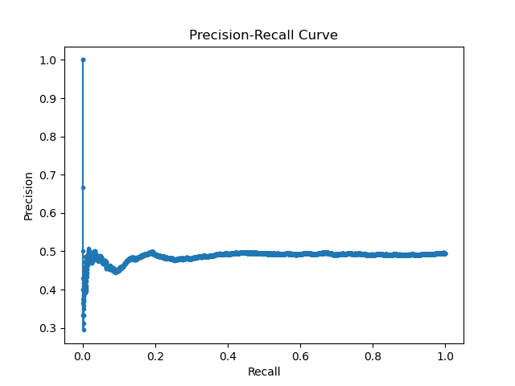
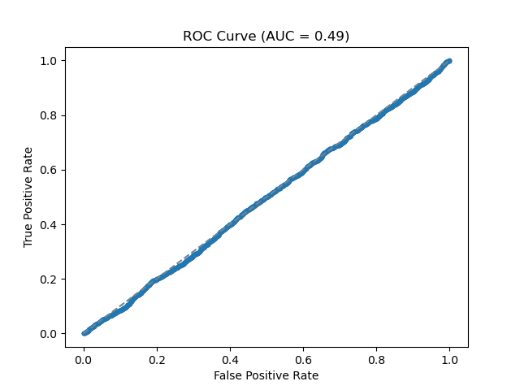
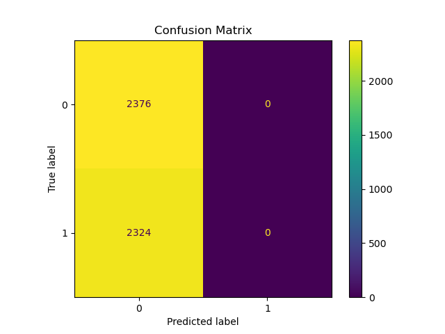
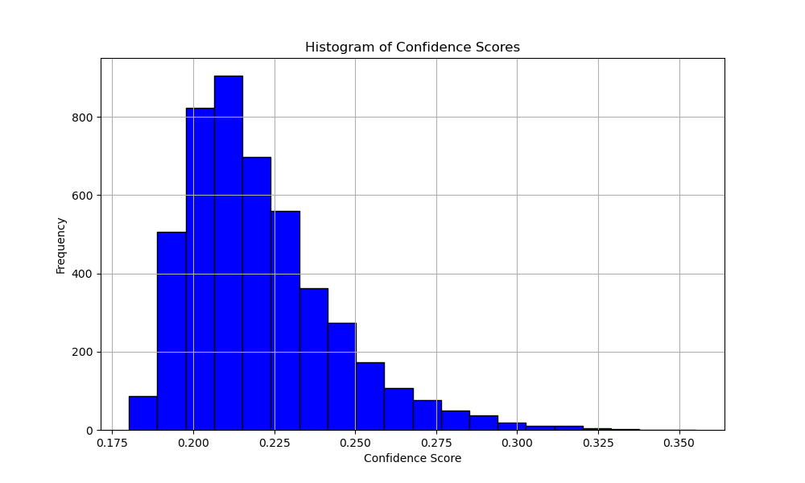

# Nudity Detection and Prevention using Faster R-CNN 
 
## Overview 

This project aims to develop a nudity detection and prevention system using the Faster R-CNN model. The model is trained to identify nudity in images and apply appropriate measures to prevent it. This repository includes all necessary scripts for data collection, model training, evaluation, and visualization.

### What is Faster R-CNN? 
Faster R-CNN is a two-stage object detection model that consists of two main components:  
   1. **Region Proposal Network (RPN)**: This network generates region proposals, which are potential bounding boxes where objects might be located. The RPN is fully convolutional, which means it shares the same convolutional layers as the main network, leading to significant performance improvements.
   2. **Fast R-CNN Detector**: This network takes the region proposals from the RPN and classifies them into different object categories while also refining the bounding box coordinates. This stage uses RoI (Region of Interest) pooling to extract fixed-size feature maps from the proposed regions. 
The combination of these two networks allows Faster R-CNN to quickly and accurately detect objects in images, making it an ideal choice for tasks like nudity detection.

## Table of Contents

- [Overview](#overview)
- [Directory Structure](#directory-structure)
- [Data Collection](#data-collection)
- [Model Training](#model-training)
- [Evaluation](#evaluation)
- [Visualization](#visualization)
- [Usage](#usage)
- [Requirements](#requirements)
- [License](#license)

## Warning 
**Content Warning**: This project involves the use of images that may be inappropriate or explicit. These images are used solely for the purpose of training the nudity detection model. Viewer discretion is advised.
## Directory Structure
```
The repository is organized as follows:
Nudity_Detection_and_Prevention_using_Faster_R-CNN/
│
├── dataset.zip/
│   ├── labels/
│   ├── train/
│   ├── validate/
│   ├── test/
│
├── models/
│   └── nudity_prevention_model.pth
│
├── scripts/
│   ├── data_collection.py             # Data collection script
│   ├── train_model.py                 # Model training script
│   ├── validate_model.py              # Model validation script
│   ├── blackout_nudes.py              # Script to blackout nudes
│   ├── generate_synthetic_labels.py   # Generate synthetic labels
│   ├── verify_clean_data.py           # Verify clean data
│   ├── precision_recall_curve.py      # Generate Precision-Recall curve
│   ├── roc_curve.py                   # Generate ROC curve
│   └── confusion_matrix.py            # Generate Confusion Matrix
│
├── visualize/
│   ├── precision_recall_curve.py      # Precision-Recall curve visualization
│   ├── roc_curve.py                   # ROC curve visualization
│   └── confusion_matrix.py            # Confusion Matrix visualization
│
├── visualizations/                    # Directory for visualization images
|
├── requirements.txt                   # Dependencies
└── README.md                          # Project documentation
```

## Data Collection

Data collection is a crucial step in this project. We used web scraping techniques to collect images for training, validation, and testing. The `data_collection.py` script in the `scripts/` directory contains the necessary code for web scraping.

### Data Directory Structure

- `dataset/train`: Contains training images.
- `dataset/validate`: Contains validation images.
- `dataset/test`: Contains test images.
- `dataset/labels`: Contains labels for the dataset.

## Model Training

The model is trained using the Faster R-CNN architecture. The `train_model.py` script in the `scripts/` directory is responsible for training the model. The pre-trained weights are saved in the `models/` directory.

## Evaluation

The model is evaluated using various metrics, and the predictions are saved in the `validation_predictions.csv` file. The `validate_model.py` script in the `scripts/` directory handles the validation process.

## Visualization

Visualization is important to understand the model's performance and the distribution of the data. The following visualizations are provided:

- **Class Distribution**: This visualization shows the frequency of each class in the predictions, helping to identify any imbalance in the dataset. It is saved as `class_distribution.png` in the `visualizations` directory.

- **Precision-Recall Curve**: This curve shows the trade-off between precision and recall for different threshold values, helping to assess the model's performance in detecting nudity. It is saved as `precision_recall_curve.png` in the `visualizations` directory.

- **ROC Curve**: The Receiver Operating Characteristic (ROC) curve plots the true positive rate against the false positive rate at various threshold settings, with the Area Under the Curve (AUC) indicating overall performance. It is saved as `roc_curve.png` in the `visualizations` directory.

- **Confusion Matrix**: This matrix shows the performance of the classification model by displaying the true positive, false positive, true negative, and false negative counts. It is saved as `confusion_matrix.png` in the `visualizations` directory.

- **Confidence Scores Histogram**: This histogram displays the distribution of confidence scores for the predictions, providing insight into the model's confidence levels. It is saved as `confidence_scores_histogram.png` in the `visualizations` directory.

- **Statistical Summaries**: Statistical summaries (mean, median, and standard deviation) of the confidence scores are saved as `confidence_scores_summary.txt` in the `visualizations` directory.

### Visualization Results

#### Class Distribution

The class distribution visualization shows the frequency of each class in the predictions. It helps identify any imbalances in the dataset.


#### Precision-Recall Curve

The Precision-Recall curve shows the trade-off between precision and recall for different threshold values. It is useful for understanding the performance of the model in detecting nudity.



#### ROC Curve

The ROC curve plots the true positive rate against the false positive rate at various threshold settings. The Area Under the Curve (AUC) provides an overall measure of model performance.



#### Confusion Matrix

The confusion matrix shows the performance of the classification model by displaying the true positive, false positive, true negative, and false negative counts.



#### Confidence Scores Histogram

The histogram of confidence scores displays the distribution of confidence scores for the predictions. This provides insight into the model's confidence levels.



#### Statistical Summaries

The statistical summaries of the confidence scores include the mean, median, and standard deviation. These summaries provide a numerical overview of the confidence scores.
```
Mean Confidence Score: 0.22
Median Confidence Score: 0.22
Standard Deviation of Confidence Scores: 0.02
```

## Usage

### Running the Model

1. **Clone the Repository**:
   ```bash
   git clone https://github.com/uv-goswami/Nudity_Detection_and_Prevention_using_Faster_R-CNN.git
   cd Nudity_Detection_and_Prevention_using_Faster_R-CNN
   ```
## Requirements

All necessary packages for this project are listed in the `requirements.txt` file. To install these dependencies, use the following command:

```bash
pip install -r requirements.txt
```
Make sure to use a Python environment where you have the required packages installed to run the scripts without any issues.

## License
This project is licensed under the MIT License. See the LICENSE file for more details.
